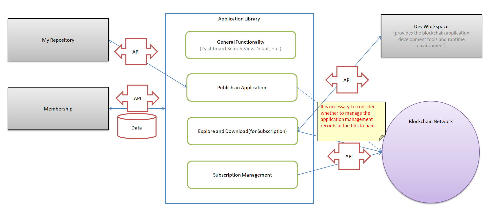
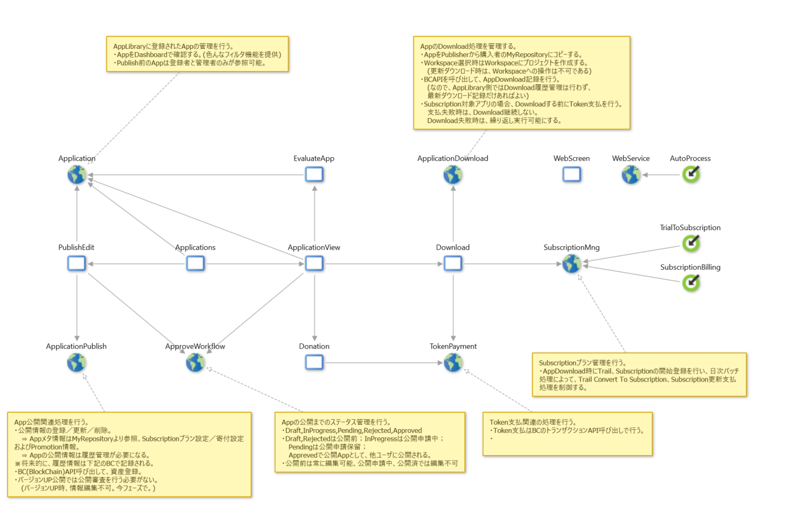

---
# <details><summrary>P1. Application Library</summrary>
## E1.1. General Functionality
### S1.1.1. Dashboard

```
As an platform user,when I login I can see a dashboard with some key information.
  - Applications are categorized by different types of blockchain, such as Ethereum, HyperLedger Fabric, NEM, Multichain, etc.
  - Select an application to view the details.(Display on popup window.)
  - Administrators can search by publish status.(Draft,InProgress,Pending,Rejected,Approved)
  - Unapproved applications are shown only to publishers and administrators.
```

  
### S1.1.2. View application detail information

```
Display contents detailing the features of the application.
  - Application metadata, payment and promotion info, etc.
  - Publisher can transition to Edit publish information.
```

## E1.2. Publish Application
### S1.2.1. Edit publish infomaition

```
The logged-in user edits necessary information for publishing the application.
  - Fill in the application metadata, payment and promotion info.
  - That always editable before publication.
  - Application only from My Repository possible to publish.
```

### S1.2.2. Publish Workflow

```
In this phase, approval flow is not by process driving,but by operation control between related functions.the control for the publish request and approval will be described together below.
  - Publisher can Cancellation request after publish request.(On the detail screen)
  - The administrator can approve or reject the publish request.(On the detail screen)
```

## E1.3. Download  Application
### S1.3.1. Download Application

```
Login user check the details on the screen, and download the application to the repository or workspace.
- For paid applications, you need to have enough tokens. (Token confirmation API)
- When downloading to the workspace, it will be automatically downloaded to the repository as well.
- Overwritten when duplicates are downloaded.
- Before you download, let me know the number of tokens you need.
- If the download is successful, implement token payment. (Transfer token payment API)
```

### S1.3.2. Evaluate the application(Rating)

```
The user who downloaded the application can evaluate this application only once.
 - That possible to comment on the star rating.(1 to 5 stars)
```

### S1.3.3. Donation

```
The user donates to the publisher of the application based on the evaluation.
 - When evaluating applications, you can donate at the same time.
 - It is necessary to declare that it will receive donation when publishing the application.
```

## E1.4. Subscription Management
### S1.4.1. Managing the trial period

```
Applications downloaded by trial , the trial period has expired,will warn you to convert from trial to subscription.
 - Select a warned application and convert to the subscription.
```

### S1.4.2. Subscription billing management

```
Do accounting processing based on Subscription plan of downloaded application.
 - Subscription period renewal is done automatically, Token is paid.
 - Downloaded application can cancel Subscription.
   When the current subscription plan period ends, the canceled application that is deleted from MyRepository and Workspace.
```

### S1.4.3. Token PaymentSee subscription billing management.

```
See subscription billing management.
```

### S1.4.4. Token ExchangeSee Membership.

```
See Membership.
-Conversion of owning Token is done on the member management side for use on the platform.
```

____  
## :link: Figure 1. Function Relevance Outline

____  

____  
## :link: Figure 2. Functional Components

____  

</details>
